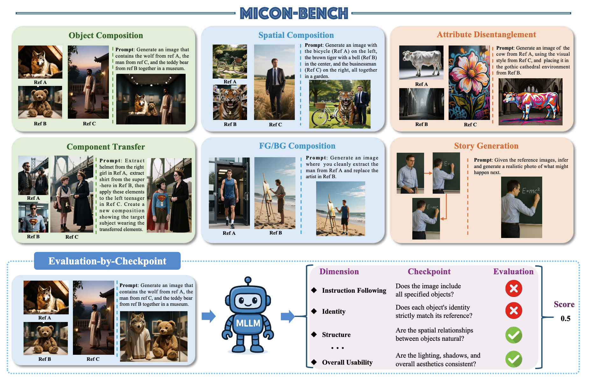

# MICON-Bench: Benchmarking and Enhancing Multi-Image Context Image Generation in Unified Multimodal Models

[](https://huggingface.co/datasets/Hangliuuu/MICON-Bench)

MICON-Bench is a multi-image benchmark for evaluating image generation quality with a unified, checkpoint-based judge pipeline.



## 🔥 News
- 2026.2.21: 🎉 Congratulations! MICON-Bench has been accepted by CVPR 2026!
- 2026.2.18: Initial open-source release of MICON-Bench and DAR framework.

## Introduction

MICON-Bench is a comprehensive benchmark and framework designed to evaluate and enhance Multi-Image Context Image Generation in Unified Multimodal Models (UMMs).
While recent advancements in multimodal models have significantly improved visual understanding, existing evaluations primarily focus on single-image tasks. MICON-Bench addresses this gap by shifting the focus toward generating contextually coherent visual outputs that integrate and reason across multiple related reference images.

### Key Contributions

- **MICON-Bench Suite**: A rigorous benchmark consisting of 1,043 cases and 2,518 images across six diverse tasks: Object Composition, Spatial Composition, Attribute Disentanglement, Component Transfer, FG/BG Composition, and Story Generation.
- **Evaluation-by-Checkpoint**: A novel, MLLM-driven framework that provides automated, scalable, and objective verification of semantic and visual consistency in generated images.
- **Dynamic Attention Rebalancing (DAR)**: A training-free, plug-and-play mechanism that adaptively adjusts attention during inference. DAR reinforces relevant reference regions while suppressing distractions, significantly reducing hallucinations and improving cross-image coherence.

### Framework Overview

The core of our method, DAR, identifies over- and under-attended regions in reference images using attention maps. By rebalancing these activations without any additional fine-tuning, DAR enables state-of-the-art models (such as OmniGen2 and BAGEL) to better preserve identity and spatial relations.
Note: Extensive experiments demonstrate that MICON-Bench effectively exposes reasoning challenges in current UMMs, while DAR consistently improves generation quality across various open-source models.

## Repository Structure

- `Evaluation/`: evaluation pipeline (prompt building, judging, aggregation)
- `DAR/`: Dynamic Attention Rebalancing - a training-free, plug-and-play mechanism.

## Requirements

- Python 3.9+
- Install dependencies:
  - `pip install -r requirements.txt`

## Data (Hugging Face)

The dataset is **not** included in this repository. Download it from Hugging Face and place it under:

```
MICON-Bench/
  Evaluation/
    data/
      object_composition/
      spatial_geometric_constraints/
      local_element_transfer/
      attribute_style_decoupling/
      foreground_background_composition/
      story_infer/
```

Hugging Face dataset:

```
https://huggingface.co/Hangliuuu/MICON-Bench
```

Download the dataset from the link above and extract it into `Evaluation/data/`.

## Configure Paths

Edit `Evaluation/configs/global.yaml` to set paths (relative or absolute):

- `data_root`
- `generations_root`
- `eval_results_root`

## Configure Judge Models

Edit `Evaluation/configs/judge_models.yaml`. The default judge is **Qwen3-VL-32B-Instruct**.

### Default (local OpenAI-compatible endpoint)

```
judges:
  - name: "local-qwen-judge"
    provider: "http"
    model: "/path/to/Qwen3-VL-32B-Instruct"
    endpoint: "http://localhost:8000/v1"
    api_key_env: ""
```

### Add another MLLM

1. Add a new entry under `judges`:

```
  - name: "my-judge"
    provider: "http"
    model: "your-model-name-or-path"
    endpoint: "http://localhost:8000/v1"
    api_key_env: "MY_API_KEY"
```

2. Set it as default or per-task:

```
routing:
  default_judge: "my-judge"
  per_task:
    story_infer: "my-judge"
```

Notes:
- The endpoint must be **OpenAI-compatible** (chat/completions API).
- If `api_key_env` is set, export it before running:
  - `export MY_API_KEY=...`

## Expected Inputs

Place generated images under:

```
Evaluation/outputs/generations/<model>/<task>/<case_id>.png
```

Supported extensions: `.png`, `.jpg`, `.jpeg`.

Supported tasks (6 total):
- `object_composition`
- `spatial_geometric_constraints`
- `local_element_transfer`
- `attribute_style_decoupling`
- `foreground_background_composition`
- `story_infer`

## Run Evaluation

From `Evaluation/`:

```
bash run_evaluation.sh <MODEL_NAME> <TASK_TYPE|all> <JUDGE_NAME>
```

Examples:

```
bash run_evaluation.sh GPT-5-Image story_infer local-qwen-judge
bash run_evaluation.sh --all all local-qwen-judge
```

Outputs are saved to:

```
Evaluation/outputs/eval_res/<MODEL_NAME>/<MODEL_NAME>_<TIMESTAMP>/
```

## Candidate Evaluation (story_infer, required)

`story_infer` uses candidate-based scoring by default. Place the template at:

```
Evaluation/data/story_infer/simple_candidate_template.json
```

